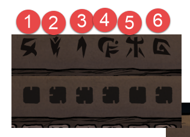

### How to use

Visit the hosted Github Page 

[https://mikesmullin.github.io/dst-metheus-mastermind-solver/]()

Make the board match what is shown in the prompt, 
and answer the prompt with the resulting number of Yellow lights, once both Player 1 and Player 2 have clicked the blue [submit] button.

### Legend:

The numbers mean slots in the following order:
```
1 | 2 | 3
4 | 5 | 6
```

The letters `U`, `N`, `M`, `Y` which appear next to the letters mean `UNKNOWN`, `NO`, `MAYBE`, and `YES` in reference to knowledge we can deduce from the result of swapping pieces over the history of plays. You can ignore them if they seem confusing.

We use the numbers instead of the symbols from the game because its easier to keep track once you realize that:

a) Player 1 and Player 2 have to move their pieces the same way at the same time, so they are really two parts of the same piece (later revealed as the item and its quantity for a certain chest slot), and;

b) The order the pieces are displayed at the top of each Player's screen are in order, and should be paired together in that order; from left-to-right 1, 2, 3, 4, 5, 6.




### See also:

- Easy Way To Solve Puzzle Two of The Metheus Puzzle | Don't Starve Together  
  [https://www.youtube.com/watch?v=d9PVHqyvXCw]()

- Where to do the puzzle:  
  [https://metheus.dontstarvetogether.com/]()
- Decode the Symbols:  
  [http://forums.kleientertainment.com/topic/77553-metheus-puzzle-part-3-spoilers-updated-with-chest-answers/?page=1]()
- Discord Group For Help:  
  [https://discordapp.com/invite/cxvPR4E]()
- What Lies Beyond?:  
  [https://www.youtube.com/watch?v=6EIvYGSeGUU]()